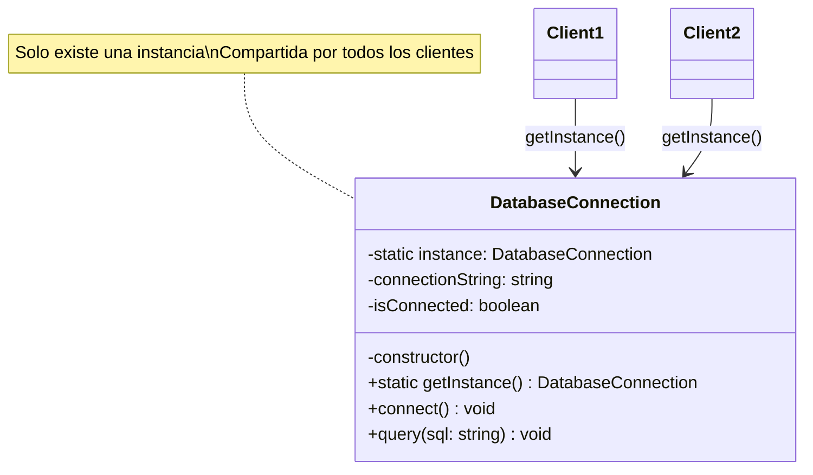
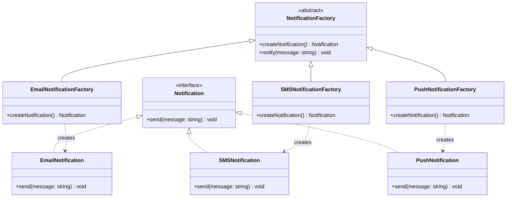
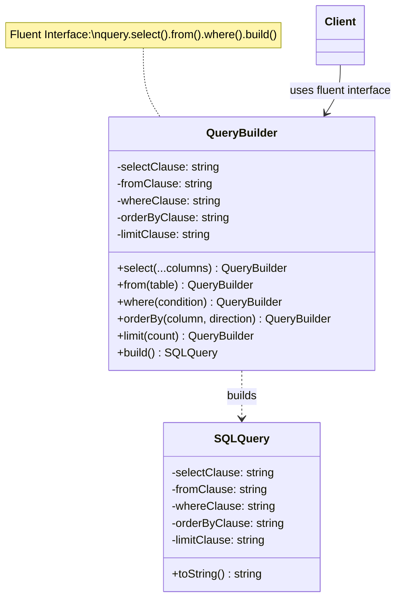
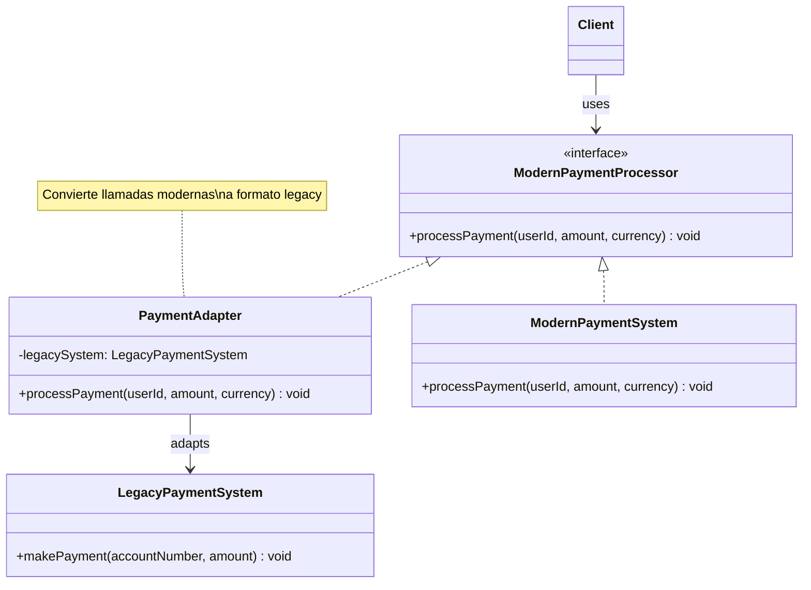
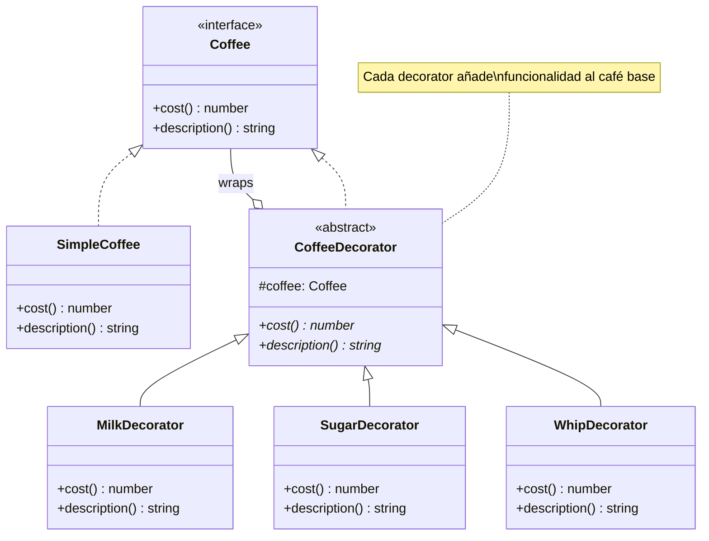
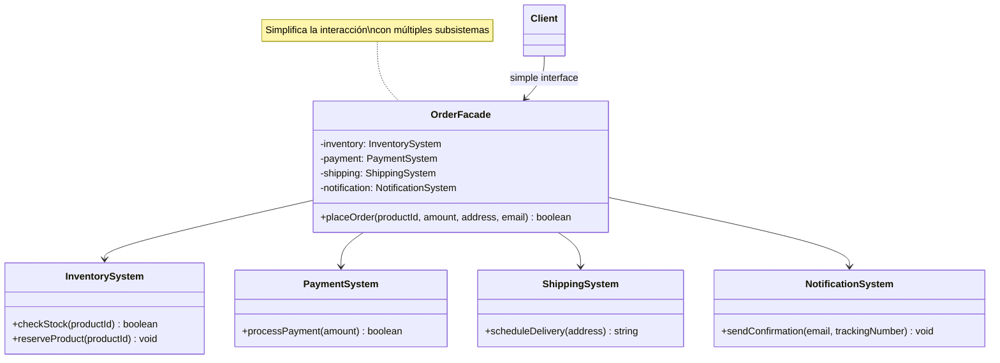
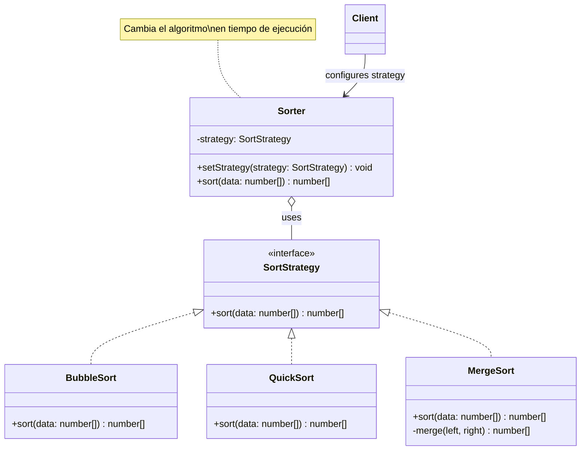
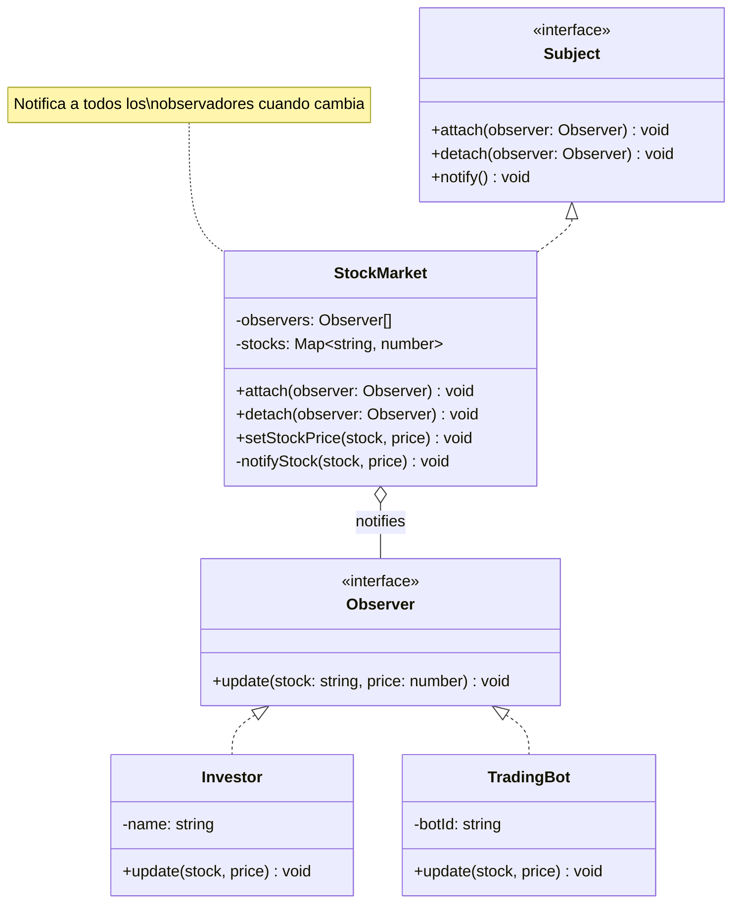
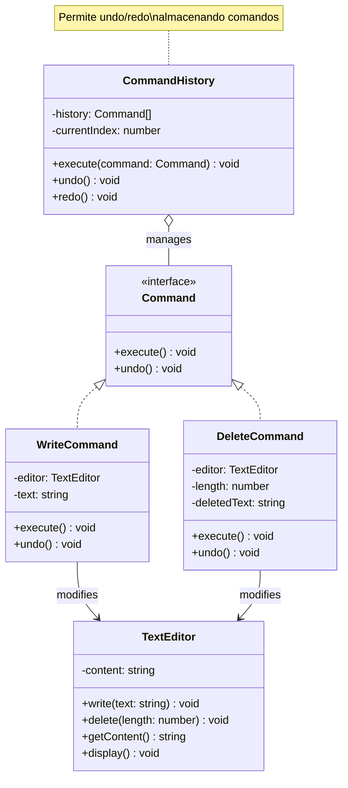

# Curso de Patrones de Diseño en TypeScript (8 horas)

## 📋 Estructura del Curso

### Módulo 1: Patrones Creacionales (2.5 horas)
- **Singleton** (50 min)
- **Factory Method** (50 min)
- **Builder** (50 min)

### Módulo 2: Patrones Estructurales (2.5 horas)
- **Adapter** (50 min)
- **Decorator** (50 min)
- **Facade** (50 min)

### Módulo 3: Patrones de Comportamiento (3 horas)
- **Strategy** (60 min)
- **Observer** (60 min)
- **Command** (60 min)

---

## 🏗️ Arquitectura del Proyecto (Principios SOLID)

Cada patrón está organizado siguiendo el **Principio de Responsabilidad Única (SRP)**:

```
src/
├── creational/
│   ├── singleton/
│   │   ├── interfaces/          # Interfaces (si aplica)
│   │   ├── classes/             # Clases separadas (una por archivo)
│   │   │   └── DatabaseConnection.ts
│   │   ├── demo/                # Demostración del patrón
│   │   │   └── example.ts
│   │   ├── example.ts           # Punto de entrada
│   │   └── exercise.ts          # Ejercicio para estudiantes
│   ├── factory/
│   │   ├── interfaces/
│   │   │   └── Notification.ts
│   │   ├── classes/
│   │   │   ├── EmailNotification.ts
│   │   │   ├── SMSNotification.ts
│   │   │   ├── PushNotification.ts
│   │   │   ├── NotificationFactory.ts
│   │   │   ├── EmailNotificationFactory.ts
│   │   │   ├── SMSNotificationFactory.ts
│   │   │   └── PushNotificationFactory.ts
│   │   ├── demo/
│   │   │   └── example.ts
│   │   ├── example.ts
│   │   └── exercise.ts
│   └── builder/
│       ├── classes/
│       │   ├── SQLQuery.ts
│       │   └── QueryBuilder.ts
│       ├── demo/
│       │   └── example.ts
│       ├── example.ts
│       └── exercise.ts
├── structural/
│   ├── adapter/
│   ├── decorator/
│   └── facade/
└── behavioral/
    ├── strategy/
    ├── observer/
    └── command/
```

### Beneficios de esta estructura:

✅ **Single Responsibility Principle**: Cada clase en su propio archivo  
✅ **Open/Closed Principle**: Fácil extender sin modificar código existente  
✅ **Dependency Inversion**: Interfaces separadas de implementaciones  
✅ **Mantenibilidad**: Fácil encontrar y modificar componentes específicos  
✅ **Testabilidad**: Cada clase puede ser testeada independientemente  

---

## 🎯 Guía para el Instructor

### Módulo 1: Patrones Creacionales

#### 1.1 Singleton (50 minutos)
**Objetivo:** Garantizar que una clase tenga una única instancia y proporcionar un punto de acceso global.

**Diagrama:**


**Tiempo sugerido:**
- Teoría y explicación: 15 min
- Demo del ejemplo: 10 min
- Ejercicio práctico: 20 min
- Revisión y preguntas: 5 min

**Puntos clave a explicar:**
- Cuándo usar Singleton (configuración, logging, conexiones DB)
- Problemas de testing y acoplamiento
- Implementación thread-safe en TypeScript

**Archivos:**
- `src/creational/singleton/classes/DatabaseConnection.ts` - Clase Singleton
- `src/creational/singleton/demo/example.ts` - Demo completa
- `src/creational/singleton/exercise.ts` - Ejercicio: Implementar ConfigManager

**Estructura SOLID:**
- Una clase = un archivo
- Responsabilidad única: gestionar la instancia única

---

#### 1.2 Factory Method (50 minutos)
**Objetivo:** Definir una interfaz para crear objetos, permitiendo a las subclases decidir qué clase instanciar.

**Diagrama:**


**Tiempo sugerido:**
- Teoría y explicación: 15 min
- Demo del ejemplo: 10 min
- Ejercicio práctico: 20 min
- Revisión y preguntas: 5 min

**Puntos clave a explicar:**
- Diferencia entre Factory Method y Abstract Factory
- Ventajas de desacoplar la creación de objetos
- Uso en frameworks modernos

**Archivos:**
- `src/creational/factory/interfaces/Notification.ts` - Interfaz común
- `src/creational/factory/classes/` - Implementaciones separadas
- `src/creational/factory/demo/example.ts` - Demo completa
- `src/creational/factory/exercise.ts` - Ejercicio: Sistema de pagos

**Estructura SOLID:**
- Interfaz separada de implementaciones
- Cada notificación en su propio archivo
- Cada factory en su propio archivo

---

#### 1.3 Builder (50 minutos)
**Objetivo:** Separar la construcción de un objeto complejo de su representación.

**Diagrama:**


**Tiempo sugerido:**
- Teoría y explicación: 15 min
- Demo del ejemplo: 10 min
- Ejercicio práctico: 20 min
- Revisión y preguntas: 5 min

**Puntos clave a explicar:**
- Cuándo usar Builder vs constructor
- Fluent interface pattern
- Inmutabilidad y validación

**Archivos:**
- `src/creational/builder/classes/SQLQuery.ts` - Producto final
- `src/creational/builder/classes/QueryBuilder.ts` - Builder
- `src/creational/builder/demo/example.ts` - Demo completa
- `src/creational/builder/exercise.ts` - Ejercicio: EmailBuilder

---

### Módulo 2: Patrones Estructurales

#### 2.1 Adapter (50 minutos)
**Objetivo:** Convertir la interfaz de una clase en otra interfaz que los clientes esperan.

**Diagrama:**


**Archivos:**
- `src/structural/adapter/interfaces/ModernPaymentProcessor.ts`
- `src/structural/adapter/classes/LegacyPaymentSystem.ts`
- `src/structural/adapter/classes/PaymentAdapter.ts`
- `src/structural/adapter/classes/ModernPaymentSystem.ts`
- `src/structural/adapter/demo/example.ts`

---

#### 2.2 Decorator (50 minutos)
**Objetivo:** Añadir responsabilidades adicionales a un objeto dinámicamente.

**Diagrama:**


**Archivos:**
- `src/structural/decorator/interfaces/Coffee.ts`
- `src/structural/decorator/classes/SimpleCoffee.ts`
- `src/structural/decorator/classes/CoffeeDecorator.ts`
- `src/structural/decorator/classes/MilkDecorator.ts`
- `src/structural/decorator/classes/SugarDecorator.ts`
- `src/structural/decorator/classes/WhipDecorator.ts`
- `src/structural/decorator/classes/CaramelDecorator.ts`
- `src/structural/decorator/demo/example.ts`

---

#### 2.3 Facade (50 minutos)
**Objetivo:** Proporcionar una interfaz unificada para un conjunto de interfaces en un subsistema.

**Diagrama:**


**Archivos:**
- `src/structural/facade/classes/InventorySystem.ts`
- `src/structural/facade/classes/PaymentSystem.ts`
- `src/structural/facade/classes/ShippingSystem.ts`
- `src/structural/facade/classes/NotificationSystem.ts`
- `src/structural/facade/classes/OrderFacade.ts`
- `src/structural/facade/demo/example.ts`

---

### Módulo 3: Patrones de Comportamiento

#### 3.1 Strategy (60 minutos)
**Objetivo:** Definir una familia de algoritmos, encapsular cada uno y hacerlos intercambiables.

**Diagrama:**


**Archivos:**
- `src/behavioral/strategy/interfaces/SortStrategy.ts`
- `src/behavioral/strategy/classes/BubbleSort.ts`
- `src/behavioral/strategy/classes/QuickSort.ts`
- `src/behavioral/strategy/classes/MergeSort.ts`
- `src/behavioral/strategy/classes/Sorter.ts`
- `src/behavioral/strategy/demo/example.ts`

---

#### 3.2 Observer (60 minutos)
**Objetivo:** Definir una dependencia uno-a-muchos entre objetos.

**Diagrama:**


**Archivos:**
- `src/behavioral/observer/interfaces/Observer.ts`
- `src/behavioral/observer/interfaces/Subject.ts`
- `src/behavioral/observer/classes/StockMarket.ts`
- `src/behavioral/observer/classes/Investor.ts`
- `src/behavioral/observer/classes/TradingBot.ts`
- `src/behavioral/observer/demo/example.ts`

---

#### 3.3 Command (60 minutos)
**Objetivo:** Encapsular una petición como un objeto.

**Diagrama:**


**Archivos:**
- `src/behavioral/command/interfaces/Command.ts`
- `src/behavioral/command/classes/TextEditor.ts`
- `src/behavioral/command/classes/WriteCommand.ts`
- `src/behavioral/command/classes/DeleteCommand.ts`
- `src/behavioral/command/classes/CommandHistory.ts`
- `src/behavioral/command/demo/example.ts`

---

## 🚀 Instrucciones de Ejecución

### Configuración inicial
```bash
npm install
npm run build
```

### Ejecutar ejemplos
```bash
npm run example:singleton
npm run example:factory
npm run example:builder
npm run example:adapter
npm run example:decorator
npm run example:facade
npm run example:strategy
npm run example:observer
npm run example:command
```

### Ejecutar ejercicios (soluciones)
```bash
npm run exercise:singleton
npm run exercise:factory
npm run exercise:builder
npm run exercise:adapter
npm run exercise:decorator
npm run exercise:facade
npm run exercise:strategy
npm run exercise:observer
npm run exercise:command
```

---

## 💡 Consejos para el Instructor

1. **Inicio de cada patrón:** Presenta un problema real antes de mostrar la solución
2. **Estructura SOLID:** Explica por qué cada clase está en su propio archivo
3. **Navegación:** Muestra cómo navegar entre interfaces, clases y demos
4. **Ejemplos:** Usa casos del mundo real que los estudiantes puedan relacionar
5. **Ejercicios:** Deja que los estudiantes trabajen en parejas (pair programming)
6. **Preguntas frecuentes:** Prepárate para explicar cuándo NO usar cada patrón
7. **Breaks:** Toma un descanso de 10 minutos cada 90 minutos

## 📚 Recursos Adicionales

- [Refactoring Guru - Design Patterns](https://refactoring.guru/design-patterns)
- [TypeScript Handbook](https://www.typescriptlang.org/docs/)
- [SOLID Principles](https://en.wikipedia.org/wiki/SOLID)

---

## ✅ Checklist del Instructor

Antes del curso:
- [ ] Verificar que todos los ejemplos compilan
- [ ] Preparar el entorno de desarrollo
- [ ] Revisar las soluciones de los ejercicios
- [ ] Familiarizarse con la estructura de carpetas
- [ ] Preparar diagramas UML (opcional)

Durante el curso:
- [ ] Compartir el repositorio con los estudiantes
- [ ] Explicar la estructura SOLID del proyecto
- [ ] Asegurar que todos pueden ejecutar los ejemplos
- [ ] Mostrar cómo navegar entre archivos relacionados
- [ ] Tomar notas de preguntas frecuentes
- [ ] Recoger feedback al final de cada módulo
