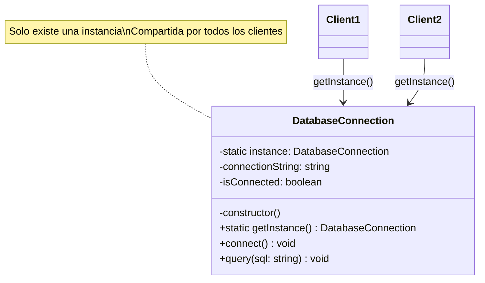
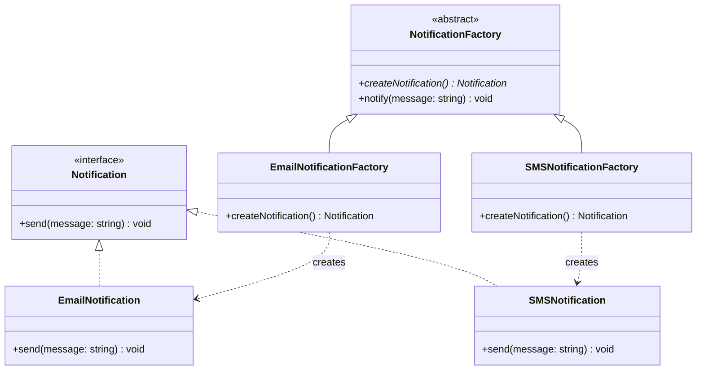
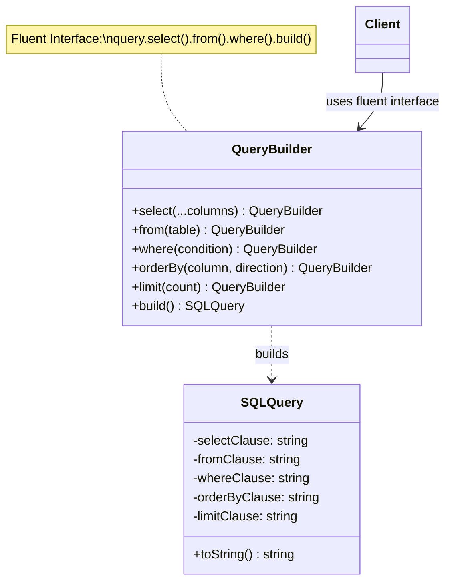
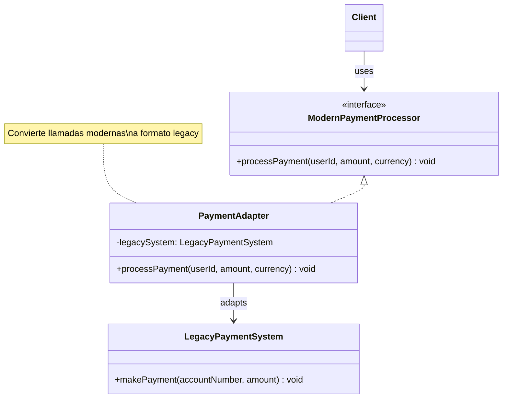
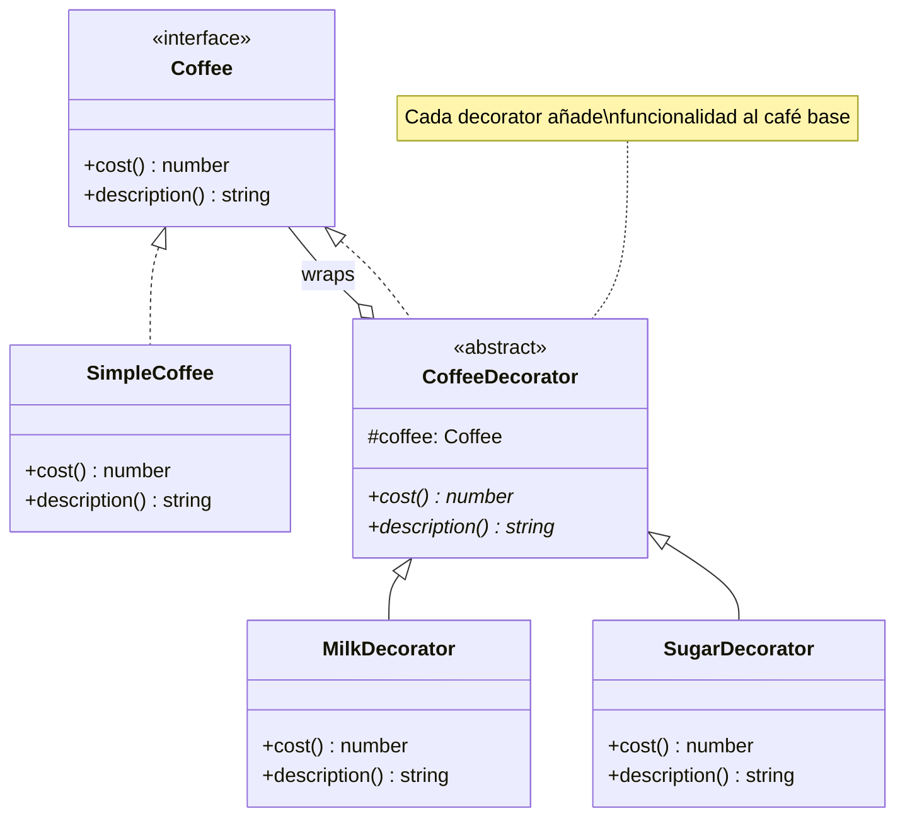
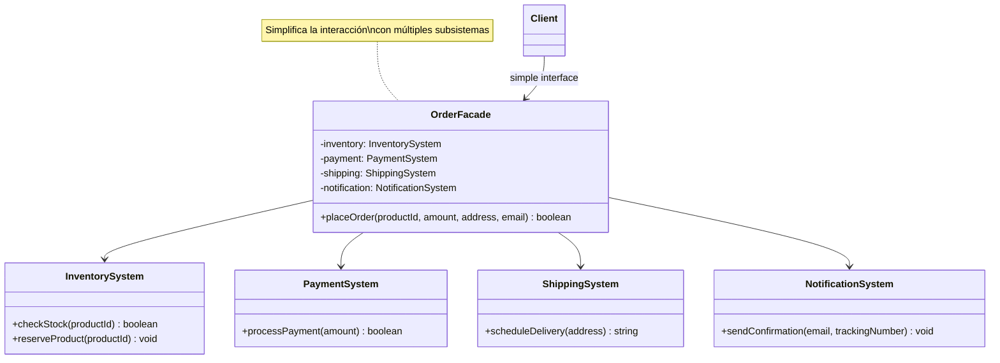
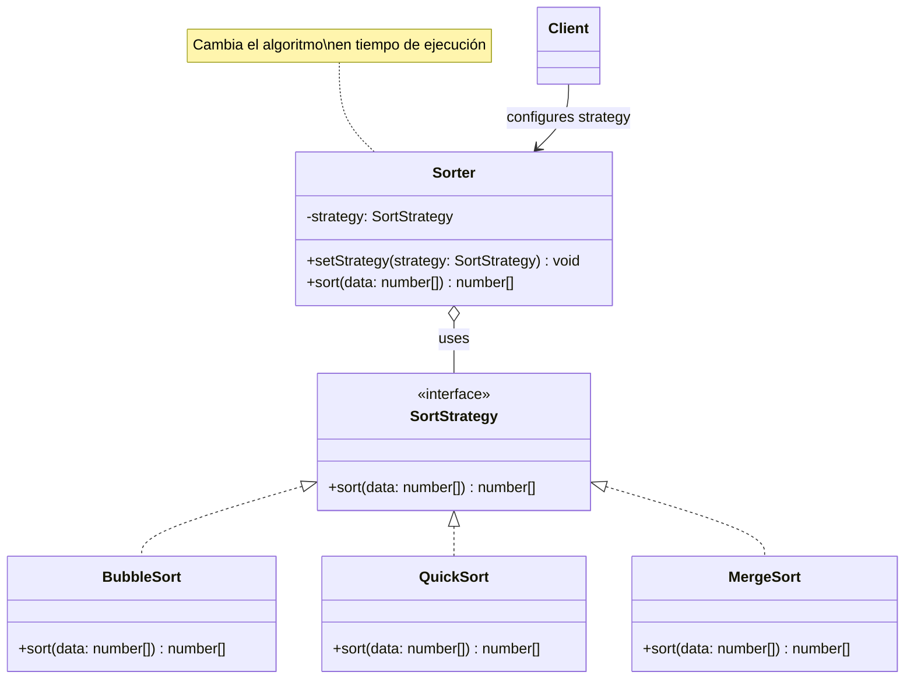
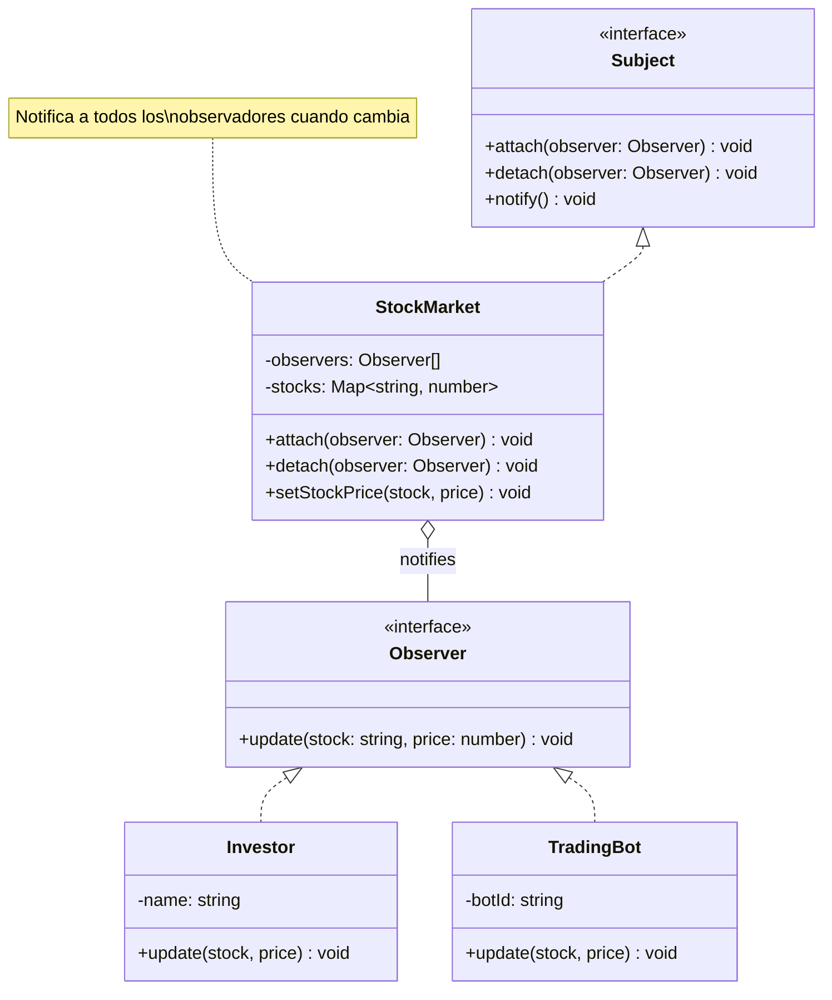
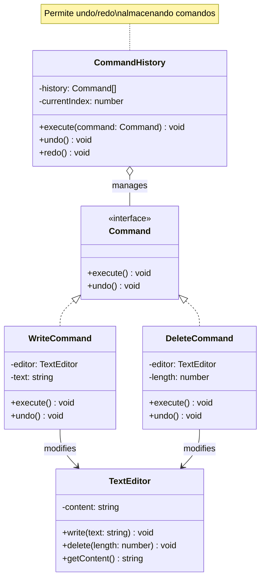

# 🎓 Guía del Estudiante: Patrones de Diseño en TypeScript

## 📚 Bienvenido

Esta guía te ayudará a entender y aplicar 9 patrones de diseño fundamentales en TypeScript. Cada patrón resuelve un problema específico y te hará un mejor programador.

---

## 🚀 Configuración Inicial

```bash
# Instalar dependencias
npm install

# Ejecutar un ejemplo
npm run example:singleton

# Probar tu solución de un ejercicio
npm run exercise:singleton
```

---

## 📖 Índice de Patrones

### 🏗️ Patrones Creacionales
1. [Singleton](#1-singleton) - Una única instancia
2. [Factory Method](#2-factory-method) - Crear objetos sin especificar la clase exacta
3. [Builder](#3-builder) - Construir objetos complejos paso a paso

### 🔧 Patrones Estructurales
4. [Adapter](#4-adapter) - Hacer que interfaces incompatibles trabajen juntas
5. [Decorator](#5-decorator) - Añadir funcionalidad sin modificar el código original
6. [Facade](#6-facade) - Simplificar sistemas complejos

### 🎭 Patrones de Comportamiento
7. [Strategy](#7-strategy) - Intercambiar algoritmos en tiempo de ejecución
8. [Observer](#8-observer) - Notificar cambios a múltiples objetos
9. [Command](#9-command) - Encapsular acciones como objetos

---

## 🏗️ Patrones Creacionales

### 1. Singleton

**¿Qué problema resuelve?**
Necesitas asegurarte de que solo exista UNA instancia de una clase en toda tu aplicación (como una conexión a base de datos).

**Diagrama:**


**¿Cómo funciona?**
1. Constructor privado (nadie puede hacer `new DatabaseConnection()`)
2. Variable estática que guarda la única instancia
3. Método `getInstance()` que retorna siempre la misma instancia

**Ejemplo del mundo real:**
- Configuración de la aplicación
- Logger (sistema de logs)
- Conexión a base de datos
- Cache global

**Código de ejemplo:**
```typescript
class DatabaseConnection {
  private static instance: DatabaseConnection;
  
  private constructor() {
    // Constructor privado
  }
  
  public static getInstance(): DatabaseConnection {
    if (!DatabaseConnection.instance) {
      DatabaseConnection.instance = new DatabaseConnection();
    }
    return DatabaseConnection.instance;
  }
}

// Uso
const db1 = DatabaseConnection.getInstance();
const db2 = DatabaseConnection.getInstance();
console.log(db1 === db2); // true - ¡Es la misma instancia!
```

**📁 Archivos:**
- `src/creational/singleton/classes/DatabaseConnection.ts`
- `src/creational/singleton/demo/example.ts`
- `src/creational/singleton/exercise.ts` - ¡Tu turno!

**🎯 Ejercicio:** Implementa un `ConfigManager` usando Singleton

---

### 2. Factory Method

**¿Qué problema resuelve?**
Necesitas crear diferentes tipos de objetos sin especificar exactamente qué clase usar. Delega la creación a subclases.

**Diagrama:**


**¿Cómo funciona?**
1. Define una interfaz común (Notification)
2. Crea diferentes implementaciones (Email, SMS, Push)
3. Cada Factory sabe cómo crear su tipo específico
4. El cliente usa la factory sin conocer la clase concreta

**Ejemplo del mundo real:**
- Sistema de notificaciones (Email, SMS, Push)
- Exportar documentos (PDF, Excel, Word)
- Crear diferentes tipos de usuarios (Admin, Cliente, Invitado)

**Código de ejemplo:**
```typescript
interface Notification {
  send(message: string): void;
}

class EmailNotification implements Notification {
  send(message: string): void {
    console.log(`📧 Email: ${message}`);
  }
}

class SMSNotification implements Notification {
  send(message: string): void {
    console.log(`📱 SMS: ${message}`);
  }
}

// Factory
abstract class NotificationFactory {
  abstract createNotification(): Notification;
  
  notify(message: string): void {
    const notification = this.createNotification();
    notification.send(message);
  }
}

class EmailNotificationFactory extends NotificationFactory {
  createNotification(): Notification {
    return new EmailNotification();
  }
}

// Uso
const factory = new EmailNotificationFactory();
factory.notify("¡Hola!"); // 📧 Email: ¡Hola!
```

**📁 Archivos:**
- `src/creational/factory/interfaces/Notification.ts`
- `src/creational/factory/classes/` - Todas las implementaciones
- `src/creational/factory/demo/example.ts`
- `src/creational/factory/exercise.ts` - ¡Tu turno!

**🎯 Ejercicio:** Implementa un sistema de pagos (CreditCard, PayPal, Crypto)

---

### 3. Builder

**¿Qué problema resuelve?**
Necesitas crear objetos complejos con muchos parámetros opcionales de forma legible y flexible.

**Diagrama:**


**¿Cómo funciona?**
1. Creas un Builder con métodos que retornan `this`
2. Encadenas llamadas (fluent interface)
3. Al final llamas `build()` para obtener el objeto

**Ejemplo del mundo real:**
- Construir queries SQL
- Crear emails complejos
- Configurar objetos HTTP request
- Construir documentos HTML

**Código de ejemplo:**
```typescript
class QueryBuilder {
  private selectClause = "";
  private fromClause = "";
  
  select(...columns: string[]): QueryBuilder {
    this.selectClause = `SELECT ${columns.join(", ")}`;
    return this; // ¡Retorna this para encadenar!
  }
  
  from(table: string): QueryBuilder {
    this.fromClause = `FROM ${table}`;
    return this;
  }
  
  build(): SQLQuery {
    return new SQLQuery(this.selectClause, this.fromClause);
  }
}

// Uso - ¡Mira qué legible!
const query = new QueryBuilder()
  .select("id", "name", "email")
  .from("users")
  .build();
```

**📁 Archivos:**
- `src/creational/builder/classes/SQLQuery.ts`
- `src/creational/builder/classes/QueryBuilder.ts`
- `src/creational/builder/demo/example.ts`
- `src/creational/builder/exercise.ts` - ¡Tu turno!

**🎯 Ejercicio:** Implementa un `EmailBuilder` para construir emails complejos

---

## 🔧 Patrones Estructurales

### 4. Adapter

**¿Qué problema resuelve?**
Tienes dos sistemas con interfaces incompatibles y necesitas que trabajen juntos (como un adaptador de enchufe).

**Diagrama:**


**¿Cómo funciona?**
1. Tienes un sistema viejo (Legacy) que no puedes cambiar
2. Creas un Adapter que implementa la interfaz nueva
3. El Adapter traduce las llamadas al formato viejo

**Ejemplo del mundo real:**
- Integrar APIs de terceros
- Usar librerías antiguas en código nuevo
- Conectar sistemas legacy con modernos
- Adaptadores de bases de datos

**Código de ejemplo:**
```typescript
// Sistema viejo que no podemos cambiar
class LegacyPaymentSystem {
  makePayment(accountNumber: string, amount: number): void {
    console.log(`Legacy: Pago de $${amount} desde ${accountNumber}`);
  }
}

// Interfaz moderna que queremos usar
interface ModernPaymentProcessor {
  processPayment(userId: string, amount: number, currency: string): void;
}

// Adapter que traduce
class PaymentAdapter implements ModernPaymentProcessor {
  constructor(private legacySystem: LegacyPaymentSystem) {}
  
  processPayment(userId: string, amount: number, currency: string): void {
    const accountNumber = `ACC-${userId}`;
    this.legacySystem.makePayment(accountNumber, amount);
  }
}

// Uso
const legacy = new LegacyPaymentSystem();
const adapter = new PaymentAdapter(legacy);
adapter.processPayment("USER123", 100, "USD");
```

**📁 Archivos:**
- `src/structural/adapter/interfaces/ModernPaymentProcessor.ts`
- `src/structural/adapter/classes/` - Todas las clases
- `src/structural/adapter/demo/example.ts`
- `src/structural/adapter/exercise.ts` - ¡Tu turno!

**🎯 Ejercicio:** Adapta diferentes sistemas de logging

---

### 5. Decorator

**¿Qué problema resuelve?**
Necesitas añadir funcionalidad a objetos sin modificar su código original. Como añadir ingredientes a un café.

**Diagrama:**


**¿Cómo funciona?**
1. Tienes un objeto base (SimpleCoffee)
2. Creas decoradores que envuelven el objeto
3. Cada decorador añade funcionalidad
4. Puedes combinar múltiples decoradores

**Ejemplo del mundo real:**
- Añadir ingredientes a comida/bebida
- Añadir formato a texto (bold, italic, underline)
- Añadir middleware a requests HTTP
- Añadir validaciones a formularios

**Código de ejemplo:**
```typescript
interface Coffee {
  cost(): number;
  description(): string;
}

class SimpleCoffee implements Coffee {
  cost() { return 2; }
  description() { return "Café simple"; }
}

abstract class CoffeeDecorator implements Coffee {
  constructor(protected coffee: Coffee) {}
  abstract cost(): number;
  abstract description(): string;
}

class MilkDecorator extends CoffeeDecorator {
  cost() { return this.coffee.cost() + 0.5; }
  description() { return this.coffee.description() + ", Leche"; }
}

// Uso - ¡Envuelve el café!
let coffee: Coffee = new SimpleCoffee();
coffee = new MilkDecorator(coffee);
console.log(coffee.description()); // "Café simple, Leche"
console.log(coffee.cost()); // 2.5
```

**📁 Archivos:**
- `src/structural/decorator/interfaces/Coffee.ts`
- `src/structural/decorator/classes/` - Todas las clases
- `src/structural/decorator/demo/example.ts`
- `src/structural/decorator/exercise.ts` - ¡Tu turno!

**🎯 Ejercicio:** Implementa decoradores para formatear texto (bold, italic, underline)

---

### 6. Facade

**¿Qué problema resuelve?**
Tienes un sistema complejo con muchas clases y quieres una interfaz simple para usarlo.

**Diagrama:**


**¿Cómo funciona?**
1. Tienes múltiples subsistemas complejos
2. Creas una Facade que los coordina
3. El cliente solo interactúa con la Facade

**Ejemplo del mundo real:**
- Sistema de pedidos (inventario + pago + envío)
- Home theater (TV + sonido + luces + DVD)
- Compilador (lexer + parser + optimizer + generator)

**Código de ejemplo:**
```typescript
class InventorySystem {
  checkStock(productId: string): boolean {
    console.log("Verificando stock...");
    return true;
  }
}

class PaymentSystem {
  processPayment(amount: number): boolean {
    console.log("Procesando pago...");
    return true;
  }
}

// Facade que simplifica todo
class OrderFacade {
  private inventory = new InventorySystem();
  private payment = new PaymentSystem();
  
  placeOrder(productId: string, amount: number): boolean {
    if (!this.inventory.checkStock(productId)) return false;
    if (!this.payment.processPayment(amount)) return false;
    console.log("¡Orden completada!");
    return true;
  }
}

// Uso - ¡Una sola llamada!
const orderSystem = new OrderFacade();
orderSystem.placeOrder("PROD-001", 99.99);
```

**📁 Archivos:**
- `src/structural/facade/classes/` - Todos los subsistemas
- `src/structural/facade/demo/example.ts`
- `src/structural/facade/exercise.ts` - ¡Tu turno!

**🎯 Ejercicio:** Implementa un `HomeTheaterFacade` para controlar TV, sonido, DVD y luces

---

## 🎭 Patrones de Comportamiento

### 7. Strategy

**¿Qué problema resuelve?**
Necesitas cambiar el algoritmo que usa un objeto en tiempo de ejecución. Como elegir diferentes métodos de ordenamiento.

**Diagrama:**


**¿Cómo funciona?**
1. Define una interfaz para el algoritmo
2. Implementa diferentes estrategias
3. El contexto usa la estrategia sin conocer los detalles
4. Puedes cambiar la estrategia en cualquier momento

**Ejemplo del mundo real:**
- Algoritmos de ordenamiento
- Métodos de compresión (ZIP, RAR, TAR)
- Estrategias de pago (tarjeta, PayPal, crypto)
- Rutas de navegación (más rápida, más corta, sin peajes)

**Código de ejemplo:**
```typescript
interface SortStrategy {
  sort(data: number[]): number[];
}

class BubbleSort implements SortStrategy {
  sort(data: number[]): number[] {
    console.log("Usando Bubble Sort");
    // ... implementación
    return data;
  }
}

class QuickSort implements SortStrategy {
  sort(data: number[]): number[] {
    console.log("Usando Quick Sort");
    // ... implementación
    return data;
  }
}

class Sorter {
  constructor(private strategy: SortStrategy) {}
  
  setStrategy(strategy: SortStrategy): void {
    this.strategy = strategy;
  }
  
  sort(data: number[]): number[] {
    return this.strategy.sort(data);
  }
}

// Uso - ¡Cambia la estrategia!
const sorter = new Sorter(new BubbleSort());
sorter.sort([3, 1, 2]);

sorter.setStrategy(new QuickSort());
sorter.sort([3, 1, 2]);
```

**📁 Archivos:**
- `src/behavioral/strategy/interfaces/SortStrategy.ts`
- `src/behavioral/strategy/classes/` - Todas las estrategias
- `src/behavioral/strategy/demo/example.ts`
- `src/behavioral/strategy/exercise.ts` - ¡Tu turno!

**🎯 Ejercicio:** Implementa estrategias de compresión (ZIP, RAR, TAR)

---

### 8. Observer

**¿Qué problema resuelve?**
Necesitas notificar a múltiples objetos cuando algo cambia. Como suscriptores a un canal de YouTube.

**Diagrama:**


**¿Cómo funciona?**
1. El Subject mantiene una lista de Observers
2. Los Observers se suscriben al Subject
3. Cuando el Subject cambia, notifica a todos
4. Cada Observer reacciona al cambio

**Ejemplo del mundo real:**
- Sistema de eventos (click, hover, etc.)
- Suscripciones a newsletters
- Notificaciones de cambios de precio
- Sistema de chat (nuevos mensajes)

**Código de ejemplo:**
```typescript
interface Observer {
  update(data: any): void;
}

class Subject {
  private observers: Observer[] = [];
  
  attach(observer: Observer): void {
    this.observers.push(observer);
  }
  
  detach(observer: Observer): void {
    const index = this.observers.indexOf(observer);
    this.observers.splice(index, 1);
  }
  
  notify(data: any): void {
    this.observers.forEach(observer => observer.update(data));
  }
}

class StockMarket extends Subject {
  setPrice(stock: string, price: number): void {
    console.log(`Precio actualizado: ${stock} = $${price}`);
    this.notify({ stock, price });
  }
}

class Investor implements Observer {
  constructor(private name: string) {}
  
  update(data: any): void {
    console.log(`${this.name} notificado: ${data.stock} = $${data.price}`);
  }
}

// Uso
const market = new StockMarket();
const investor1 = new Investor("Juan");
const investor2 = new Investor("María");

market.attach(investor1);
market.attach(investor2);

market.setPrice("AAPL", 150); // Ambos son notificados
```

**📁 Archivos:**
- `src/behavioral/observer/interfaces/` - Observer y Subject
- `src/behavioral/observer/classes/` - Implementaciones
- `src/behavioral/observer/demo/example.ts`
- `src/behavioral/observer/exercise.ts` - ¡Tu turno!

**🎯 Ejercicio:** Implementa una estación meteorológica con múltiples displays

---

### 9. Command

**¿Qué problema resuelve?**
Necesitas encapsular acciones como objetos para poder deshacerlas, encolarlas o registrarlas. Como Ctrl+Z.

**Diagrama:**


**¿Cómo funciona?**
1. Encapsulas cada acción en un objeto Command
2. Cada Command sabe cómo ejecutarse y deshacerse
3. Guardas los comandos en un historial
4. Puedes hacer undo/redo navegando el historial

**Ejemplo del mundo real:**
- Editor de texto (undo/redo)
- Control remoto (cada botón es un comando)
- Sistema de transacciones
- Macros (grabar y reproducir acciones)

**Código de ejemplo:**
```typescript
interface Command {
  execute(): void;
  undo(): void;
}

class TextEditor {
  private content = "";
  
  write(text: string): void {
    this.content += text;
  }
  
  delete(length: number): void {
    this.content = this.content.slice(0, -length);
  }
  
  getContent(): string {
    return this.content;
  }
}

class WriteCommand implements Command {
  constructor(private editor: TextEditor, private text: string) {}
  
  execute(): void {
    this.editor.write(this.text);
  }
  
  undo(): void {
    this.editor.delete(this.text.length);
  }
}

class CommandHistory {
  private history: Command[] = [];
  private currentIndex = -1;
  
  execute(command: Command): void {
    command.execute();
    this.history.push(command);
    this.currentIndex++;
  }
  
  undo(): void {
    if (this.currentIndex >= 0) {
      this.history[this.currentIndex].undo();
      this.currentIndex--;
    }
  }
}

// Uso
const editor = new TextEditor();
const history = new CommandHistory();

history.execute(new WriteCommand(editor, "Hola"));
history.execute(new WriteCommand(editor, " Mundo"));
console.log(editor.getContent()); // "Hola Mundo"

history.undo();
console.log(editor.getContent()); // "Hola"
```

**📁 Archivos:**
- `src/behavioral/command/interfaces/Command.ts`
- `src/behavioral/command/classes/` - Todas las clases
- `src/behavioral/command/demo/example.ts`
- `src/behavioral/command/exercise.ts` - ¡Tu turno!

**🎯 Ejercicio:** Implementa un control remoto para dispositivos del hogar

---

## 🎯 Cómo Practicar

### 1. Ejecuta los Ejemplos
```bash
npm run example:singleton
npm run example:factory
# ... etc
```

### 2. Lee el Código
Navega por los archivos en `src/` y entiende cómo está organizado cada patrón.

### 3. Haz los Ejercicios
Cada patrón tiene un archivo `exercise.ts` con instrucciones. ¡Intenta resolverlo antes de ver la solución!

### 4. Experimenta
Modifica los ejemplos, añade funcionalidad, rompe cosas y arreglalas.

---

## 📚 Recursos Adicionales

- [Refactoring Guru](https://refactoring.guru/design-patterns) - Explicaciones visuales excelentes
- [TypeScript Handbook](https://www.typescriptlang.org/docs/) - Documentación oficial
- [SOLID Principles](https://en.wikipedia.org/wiki/SOLID) - Principios de diseño

---

## 💡 Consejos Finales

1. **No memorices** - Entiende el problema que resuelve cada patrón
2. **Practica** - Implementa los ejercicios sin mirar las soluciones
3. **Pregunta** - Si algo no tiene sentido, pregunta al instructor
4. **Aplica** - Piensa en cómo usar estos patrones en tus proyectos
5. **No abuses** - No uses patrones solo porque sí, úsalos cuando resuelvan un problema real

---

## 🤝 ¿Necesitas Ayuda?

- Revisa los diagramas para entender la estructura
- Lee los comentarios en el código
- Ejecuta los ejemplos y observa la salida
- Compara tu solución con la proporcionada
- Pregunta al instructor

---

**¡Buena suerte y feliz aprendizaje! 🚀**
